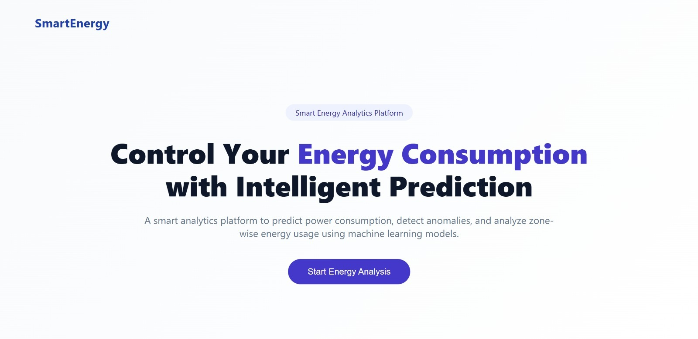

# SMART ENERGY CONSUMPTION, PREDICTION AND OPTIMIZATION

## Project Overview
This project is an Energy Management System that predicts electricity consumption using Machine Learning techniques. The system analyzes weather and time-related features to estimate power usage for different zones.

The project also includes:
- Electricity Consumption Prediction
- Anomaly Detection
- Energy Optimization

---

# Objectives
- Predict electricity consumption accurately
- Detect abnormal power usage patterns
- Identify low-energy consumption hours
- Improve smart energy management

---

# Dataset Information

The dataset contains:
- Datetime
- Temperature
- Humidity
- Wind Speed
- Power Consumption (Zone 1, Zone 2, Zone 3)

## Dataset Source
https://www.kaggle.com/datasets/fedesoriano/electric-power-consumption

---

# Technologies Used
- Python
- Flask
- React.js
- Vite
- Machine Learning
- Scikit-learn
- Pandas
- NumPy

---

# Execution Steps

## 1. Clone the Repository

```bash
git clone <your-github-repository-link>
```

## 2. Open the Project Folder

```bash
cd ML
```

---

# Backend Setup (Run First)

## 3. Navigate to Backend Folder

```bash
cd backend
```

## 4. Install Required Packages

```bash
pip install -r requirements.txt
```

## 5. Start Backend Server

```bash
python app.py
```

Backend will run at:

```bash
http://localhost:5000
```

---

# Frontend Setup (Run After Backend)

## 6. Open a New Terminal

## 7. Navigate to Frontend Folder

```bash
cd frontend
```

## 8. Install Frontend Dependencies

```bash
npm install
```

## 9. Start Frontend Server

```bash
npm run dev
```

Frontend will run at:

```bash
http://localhost:5173
```

---

# Project Workflow

1. Start the backend server  
2. Start the frontend server  
3. Open the frontend URL in browser  
4. Enter input values or upload data  
5. Generate electricity consumption predictions  
6. Detect anomalies and analyze energy usage  

---

# Output Screenshots

## Home Page


## Power Prediction


## Zone Wise Analysis


## Anomaly Detection


## Anomaly Result


## Energy Usage Chart


---